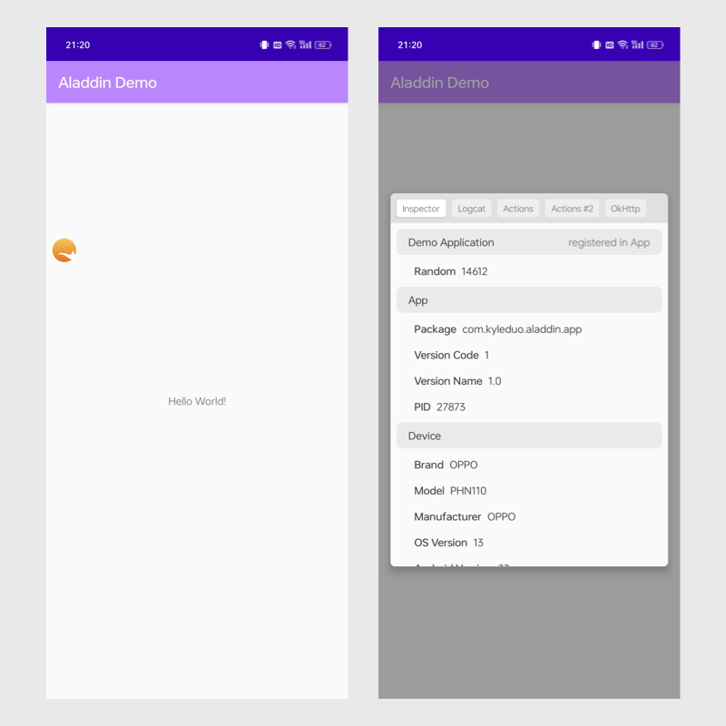

# Aladdin

> If you ever wanna a magic lamp to help your daily development, here it is. Welcome Aladdin!

[中文](README_ZH.md)

Aladdin is more than a framework for Android developers to debug your App in a more efficient way. Aladdin is designed to be extendable. All specific features provided by Aladdin is a plugin of this framework. A feature is called `Genie`, who lives in the lamp, absolutely. Consumer can use pre-defined genies or develop your own genie for business specific purpose. Customised genie can work with orther genies as well.

## Demo

Here're screenshots of demo application. Consumer can have these features just out of box.

## Architecture

### Terms

- **Genie**: Feature unit of Aladdin. For example, `LogcatGenie` provides ability to inspect app's logcat at runtime. Genie can has its own top-level float view or a panel view hosted by `BoardGenie`.
- **Consumer API** layer: APIs that consumer can use to leverage Aladdin's ability.
- **Extension API** layer: APIs that consuemr can use to implement customized `AladdinGenie`.
- **Implementation** layer: Implementation of Aladdin framework. 

### Components Explains

- core-api
  - Provides top-level APIs for consumer to initialized Aladdin and use features provided by it.
  - `Aladdin`
    - The only one top-level entry to access features of Aladdin. All Aladdin's APIs should start from this class.
  - `AladdinConfigurator`
    - Data structure to initialize Aladdin.
  - `AladdinContext`
    - Interface used by AladdinGenie's implements to access abilities provided by Aladdin framework.
  - `AladdinGenie`
    - Interface of a genie. All genies should implement this interface.
  - `AladdinView`
    - Represents a View can be shown above App window. To show a custom AladdinView, implement the interface and register the instance to `AladdinViewManager`. `EntryGenie` is an example of implementation of this interface.
- genies
  - A group of modules. Out of box genies provided by Aladdin framework.
- built-in genies
  - Aladdin framework has 2 built-in genies to provide foundamental ability to display an entry of the genie board and the board itself. The 2 genies has no difference from general customized genies.
- core
  - A module contains core components of Aladdin framework. It implements interfaces of core-api module.
- design
  - Aladdin provides several basic custom widgets and general styles can be used in genies.
