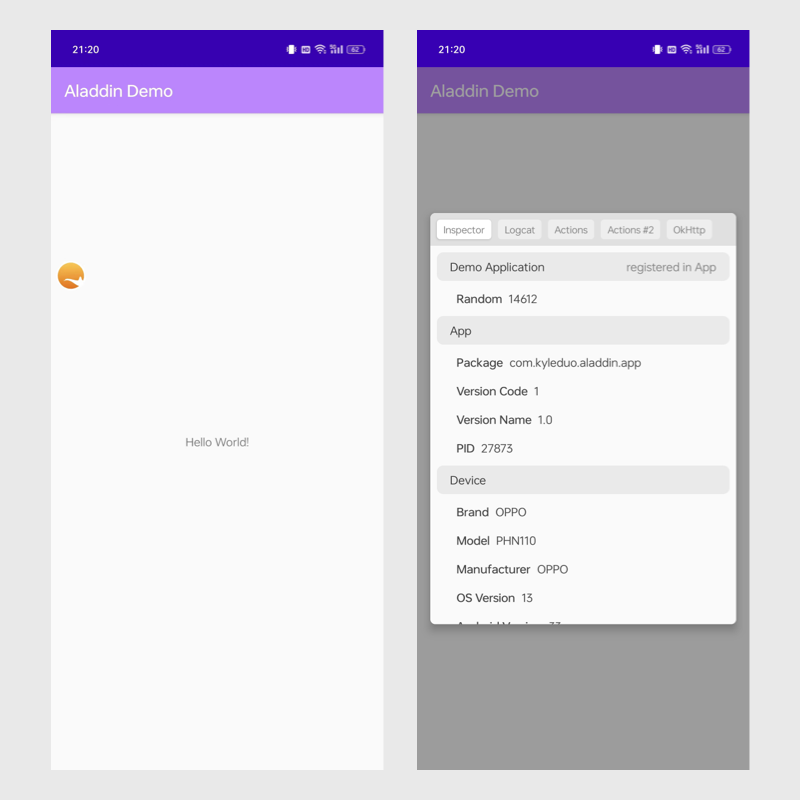
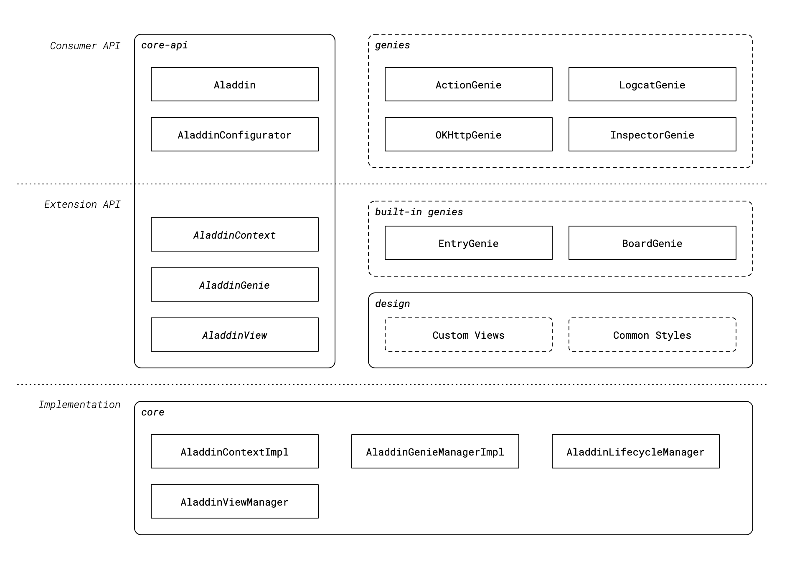

# Aladdin

> If you ever wanna a magic lamp to help your daily development, here it is. Welcome Aladdin!

Aladdin不仅是一个可以帮Android开发者更高效地调试App的框架。Aladdin被设计成具有跟强的扩展性。Aladdin提供的所有特定功能都是通过一种插件实现的。一个功能被称作一个 Genie ，当然，生活在灯里的嘛。用户可以使用预定义的genie或者根据业务需要开发自己的genie。自定义的genie可以和其它genie协同工作。

## Demo

一些Demo应用的截图，用户可以直接使用这些开箱即用的功能。

## 架构

### Terms

- **Genie**: Aladdin的功能单元。例如：`LogcatGenie`提供了在运行时检视App的logcat的能力。genie可以由独立的控件承载，也可以由BoardGenie实现的面板承载，作为其中的一个标签卡。
- **Consumer API** layer: 用户可以直接使用的API。
- **Extension API** layer: 用户实现`AladdinGenie`扩展Aladdin能力用到的API。
- **Implementation** layer: Aladdin框架的实现。

### Components Explains

- core-api
  - 提供顶层API供使用者初始化、访问Aladdin和genies提供的功能。
  - `Aladdin`
    - 唯一顶级入口，所有的API访问都应从对Aladdin的调用开始。
  - `AladdinConfigurator`
    - 初始化Aladdin的配置数据结构
  - `AladdinContext`
    - 提供给`AladdinGenie`访问的内部接口，用来访问Aladdin框架提供的功能。
  - `AladdinGenie`
    - genie是Aladdin提供给使用者的功能单元。AladdinGenie是genie需要实现的接口。
  - `AladdinView`
    - 需要在App上层显示辅助信息的genie，需要实现这个接口并将实现类的实力提供给AladdinViewManager。如内置的genie，EntryGenie创建了悬浮球入口。
- genies
  - Aladdin已经实现了一系列开箱即用的功能，包括Logcat、OKHttp等。
- built-in genies
  - Aladdin框架内实现的两个基础genie，用来实现悬浮球入口和调试面板本体。和普通genie无异，没有额外特权。
- core
  - Aladdin框架的实现。实现类对应的接口都在core-api中。如果想深度定制Aladdin，可以完全自定义core包并自行实现core-api中的接口。
  - 自定义genie不需要依赖core包，仅依赖core-api即可。
- design
  - Aladdin框架提供的自定义genie可能用到的基础UI组件和样式。
